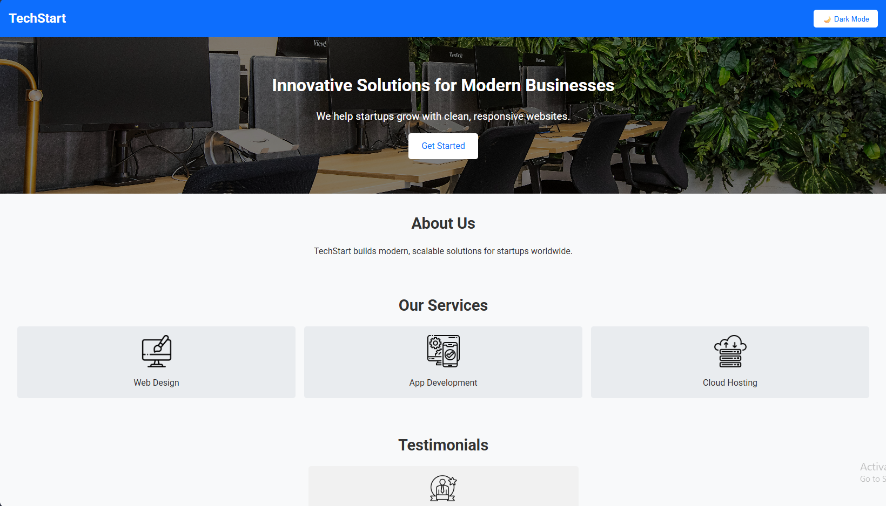
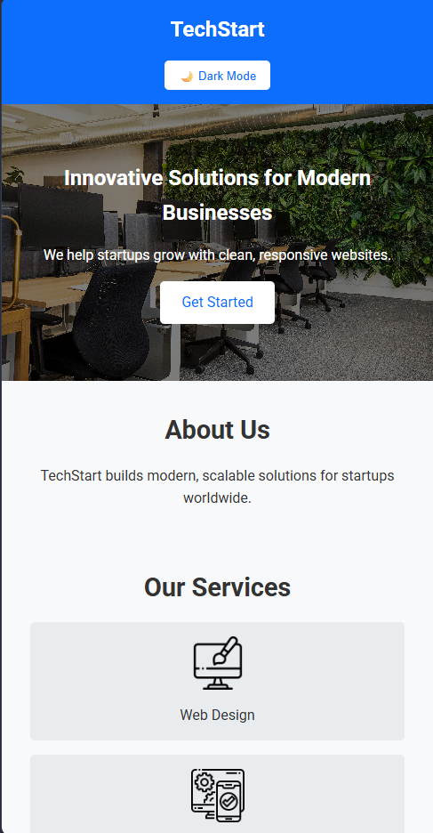

# Responsive Landing Page - TechStart

## Overview

A modern, responsive one-page landing site for a fake tech startup. Built with HTML, CSS, and JavaScript to demonstrate clean design and interactivity.

## Features

- Hero section with logo, headline, and CTA button
- About, Services, Testimonials, and Contact sections
- Dark mode toggle (JavaScript)
- Responsive layout using Flexbox and Grid
- Google Fonts (Roboto) for professional typography

## Tech Stack

- HTML5
- CSS3 (Flexbox, Grid)
- JavaScript (DOM manipulation)

## Deployment

- Live Demo: [\[Demo Link Here\]](https://responsive-landing-theta.vercel.app/)
- GitHub Repo: [\[Repo Link Here\]](https://github.com/Momna533/responsive-landing)

## Screenshots

## Author

Momna Ijaz – Frontend Developer
