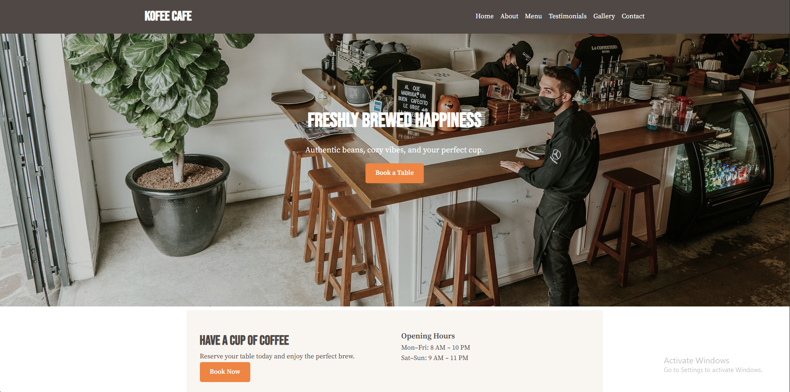
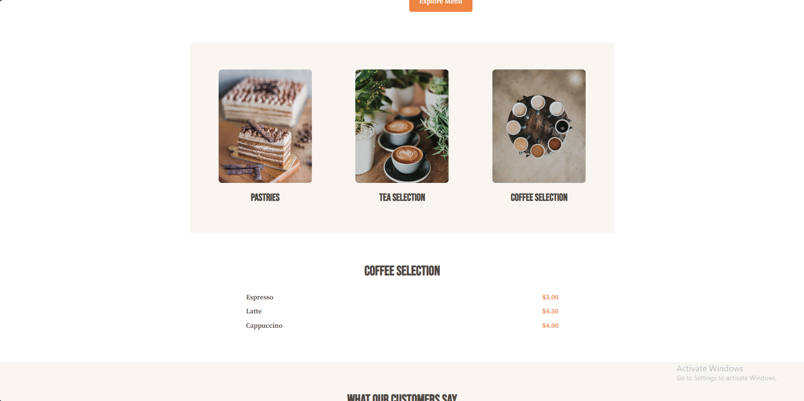

# ☕ Coffee Shop Landing Page

A minimalist, responsive landing page built with **HTML, CSS, and JavaScript**.  
This project showcases the cafe’s atmosphere, menu, testimonials, and includes a working contact form.

---

## 🚀 Live Demo

👉 [View Website](https://landing-page-two-pink-76.vercel.app/)

---

## 📸 Screenshots

### Home / Hero Section



### Menu Section



---

## 📌 Features

- Responsive design (mobile‑first)
- Hero, Booking, About, Menu, Testimonials, Gallery, Contact sections
- Interactive contact form with validation
- Smooth scrolling navigation
- SEO meta tags + favicon
- Hosted on Netlify/GitHub Pages

---

## 🛠️ Technologies Used

- **HTML5** → semantic structure
- **CSS3** → Flexbox/Grid, responsive design, media queries
- **JavaScript (ES6)** → form validation, smooth scroll, testimonial slider

---

## 📂 Project Structure

```
coffee-shop-landing/
│── index.html
│── style.css
│── script.js
│── assets/
    ├── hero.jpg
    ├── about.jpg
    ├── pastries.jpg
    ├── tea.jpg
    ├── coffee.jpg
    ├── gallery1.jpg
    ├── gallery2.jpg
    ├── gallery3.jpg
    └── favicon.png
```

---

## 📖 How to Run Locally

1. Clone this repo:
   ```bash
   git clone https://github.com/Momna533/landing-page
   ```
2. Open `index.html` in your browser.
3. Customize content in `index.html`, styles in `style.css`, and scripts in `script.js`.

---

## 📧 Contact

Created by **Momna Ijaz**  
Frontend Developer & Freelancer

📩 Email: momnadev533gb@gmail.com

---
